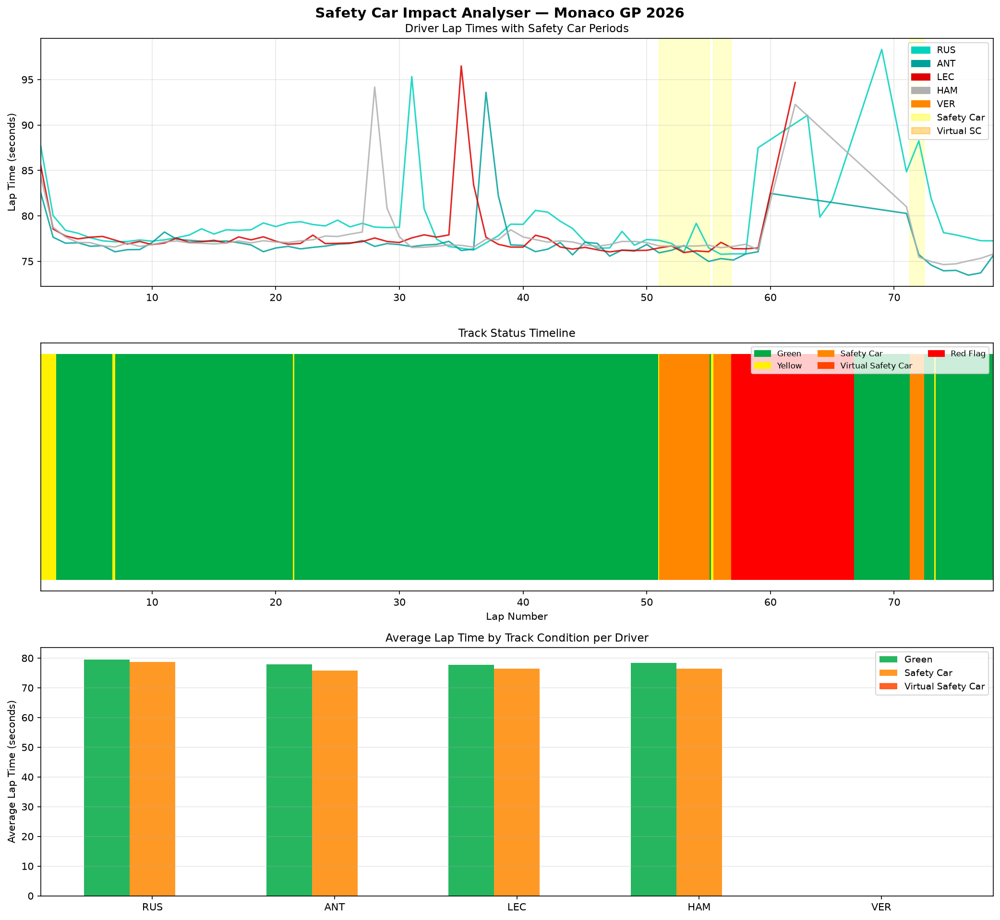

# F1 Safety Car Impact Analyser

A Python tool that analyses how safety car and virtual safety car periods 
affect lap times and race strategy during a Formula 1 Grand Prix.

## What it does

This script loads race and track status data for a chosen Grand Prix and 
produces three stacked charts:

- Driver lap times with safety car periods shaded — showing exactly how 
  lap times change when the safety car is deployed
- Track status timeline — a colour coded bar showing the full race status 
  history lap by lap including green, yellow, safety car, VSC and red flag periods
- Average lap time by track condition per driver — comparing each driver's 
  average pace under green flag, safety car and VSC conditions

## Example Output

This example analyses the 2026 Monaco GP. The track status timeline reveals 
a safety car period around lap 55 followed by a red flag stoppage around lap 
65 — one of the most strategically significant events of the race, allowing 
all drivers a free tyre change. The lap time chart clearly shows all drivers 
slowing significantly during the safety car period.

## Tech Stack

- Python
- [FastF1](https://github.com/theOehrly/Fast-F1) — official F1 timing and telemetry data
- Matplotlib — data visualisation
- Pandas — data handling
- NumPy — numerical calculations

## How to Run

1. Install dependencies: `pip install fastf1 matplotlib pandas numpy`
2. Run the script: `python safety_car_analyser.py`
3. Chart will display and save as `safety_car_analyser.png`

## Why This Project

Safety car and red flag periods are among the most critical moments in race 
strategy. A well-timed pit stop under safety car conditions can gain multiple 
positions — while a poor response can cost a race win. This tool builds the 
analytical foundation for understanding and responding to these pivotal moments.

## Author

Hamna Shahzad — Electrical Engineering Student | Aspiring Motorsport Engineer
